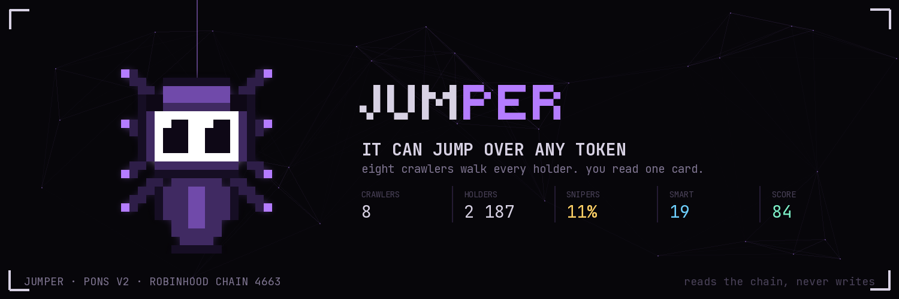
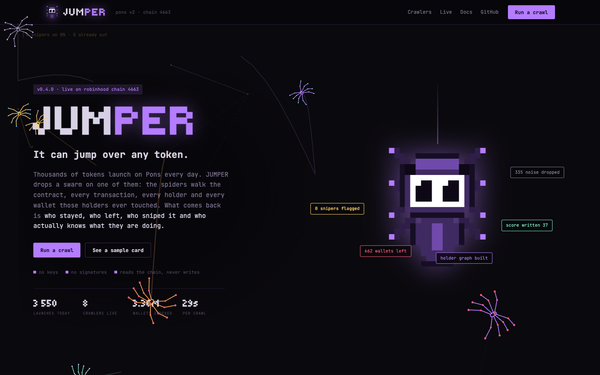
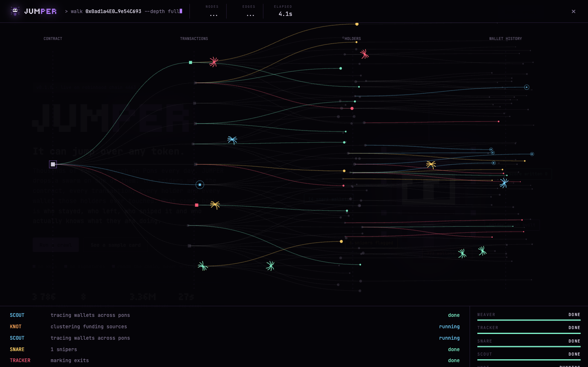
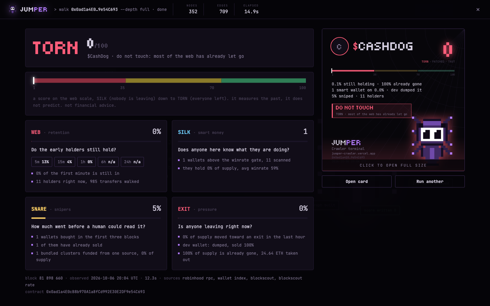
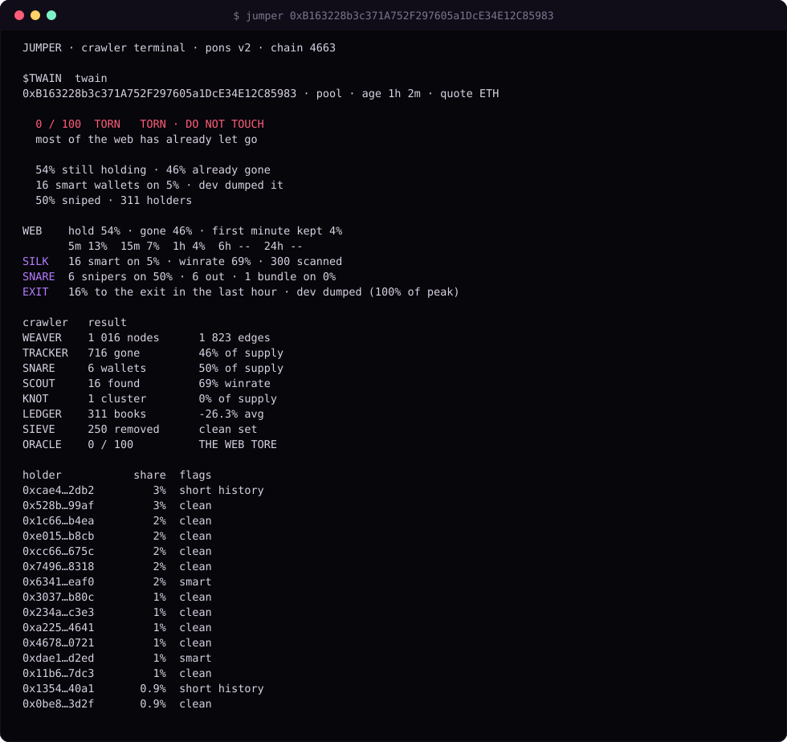
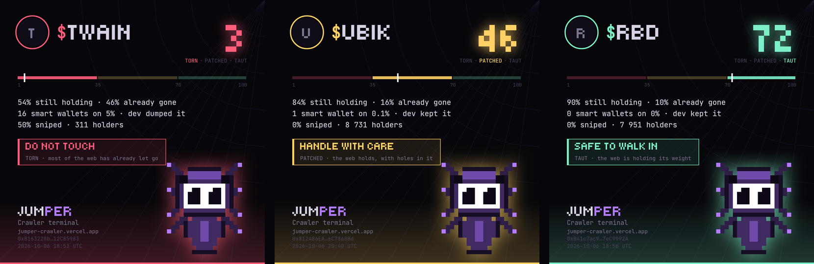
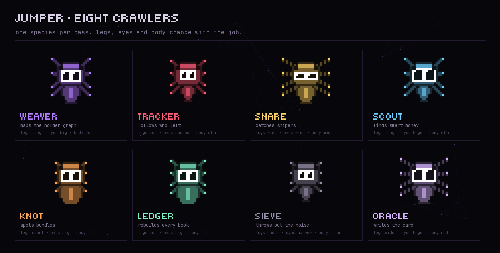
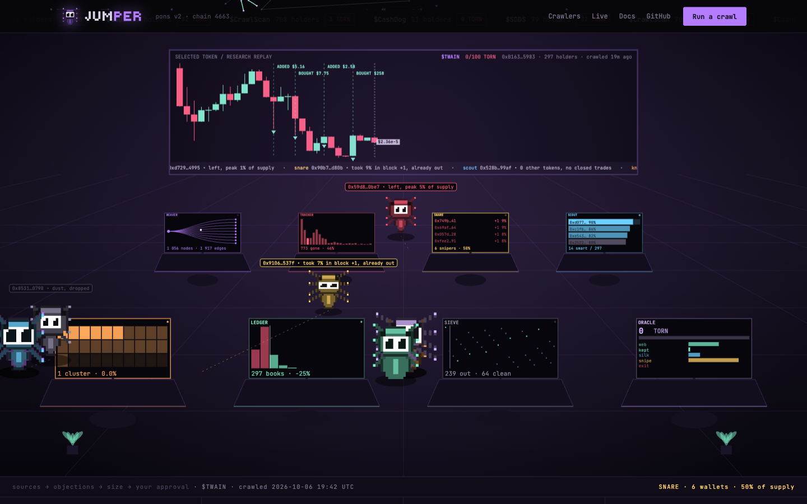
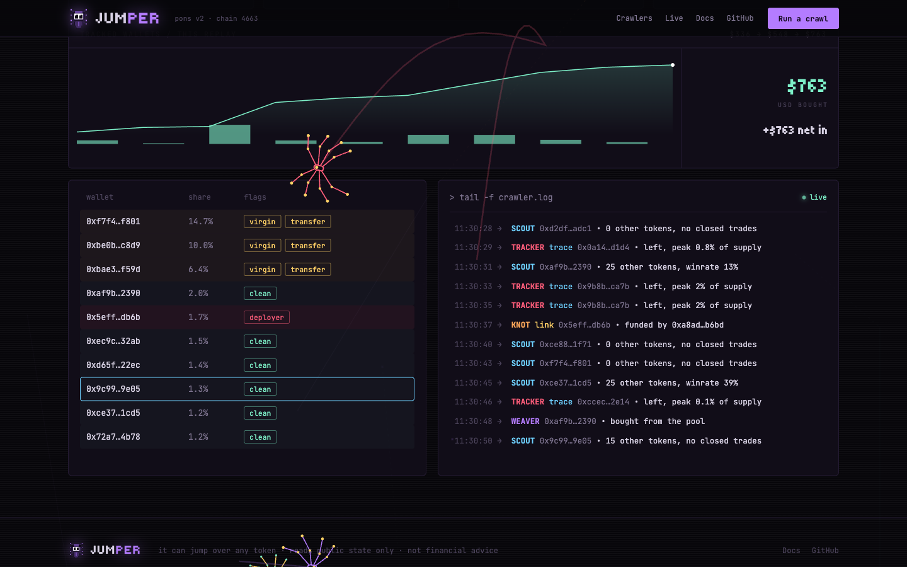
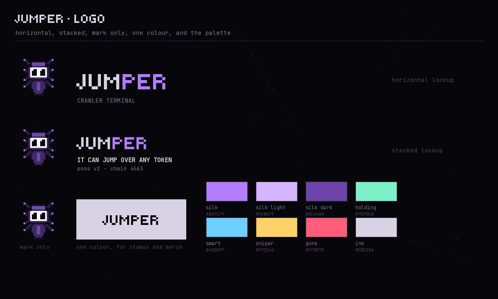

<p align="center"></p>
<p align="center"></p>

<p align="center">
  <a href="https://github.com/Skynet-inisghts/JUMPER/actions/workflows/ci.yml"></a>
  
  
  
  
  <a href="LICENSE"></a>
</p>

<p align="center"><strong>It can jump over any token.</strong><br/>A crawler terminal that takes a Pons v2 token apart through its holders.</p>
<p align="center"><a href="https://jumper-crawler.vercel.app">Website</a> · <a href="https://jumper-crawler.vercel.app/?token=0xb163228b3c371a752f297605a1dce34e12c85983">Run a crawl</a> · <a href="#run-it">Start locally</a> · <a href="#the-eight-crawlers">Crawlers</a> · <a href="#relayers-and-routers">Relayers and routers</a> · <a href="#limits">Limits</a></p>

<p align="center"></p>

## What it is

A chart tells you what a token did. It does not tell you who is sitting in it, or what they are worth.

JUMPER drops a swarm of eight crawlers on one token. Each walks one surface: the holder graph, the wallets that left, the snipers, the smart money, the bundles, every holder's book, the noise. The ninth step folds it all into one score from 0 to 100 and one verdict on the web scale.

```
0-34    TORN      DO NOT TOUCH
35-69   PATCHED   HANDLE WITH CARE
70-100  TAUT      SAFE TO WALK IN
```

Read only. No wallet connection, no keys for the basics, no signatures, no transactions.

### One crawl, start to finish

<p align="center"></p>

The swarm walks the token in four layers: the contract, its transactions, the holders, and every other token those holders ever traded. Nodes turn green for wallets still holding, cyan for smart money, yellow for snipers, red for wallets that left. Each crawler's bar runs queued, running, done as the stream comes in.

<p align="center"></p>

The report folds it into four questions. **WEB**: do the early holders still hold, at 5m, 15m, 1h, 6h, 24h. **SILK**: does anyone here know what they are doing. **SNARE**: how much went before a human could read the ticker. **EXIT**: is anyone leaving right now. The card on the right is the share image, rendered on the server from the same report.

## Run it

```bash
git clone https://github.com/Skynet-inisghts/JUMPER && cd JUMPER
pnpm install && pnpm build:cli
pnpm jumper 0xb163228b3c371a752f297605a1dce34e12c85983
```

```bash
pnpm jumper <ca|$TICKER>            # crawl, report to the console
pnpm jumper <ca> --card             # plus the 1080x1080 PNG in ./out
pnpm jumper <ca> --json             # machine output
pnpm jumper <ca> --tape t.json      # also save the raw tape the crawlers read
pnpm jumper replay t.json           # run the crawlers over a saved tape, offline
pnpm jumper doctor                  # check every source the crawl reads
```

A crawl takes 5 to 90 seconds, most of it reading the token's transfer log from the public RPC.

<p align="center"></p>

The same report in a terminal. A real crawl of $TWAIN, an hour after launch: six wallets took half the supply in the block after launch and all six had sold by the time the swarm arrived. [Captured data](assets/readme/terminal.json)

### Share cards

<p align="center"></p>

1080x1080, one per crawl, coloured by the band: red for TORN, yellow for PATCHED, green for TAUT. All three are real crawls; the block and time they describe are printed on them and in [twain](assets/readme/card-twain.json), [ubik](assets/readme/card-ubik.json) and [rbd](assets/readme/card-rbd.json). They describe that moment, not today.

## The eight crawlers

<p align="center"></p>

They run as a pipeline, each handing its result to the next.

| # | crawler | what it does |
|---|---|---|
| 1 | **WEAVER** | pulls every transfer and lays the holders out as a graph: parent to child, first buyer to last |
| 2 | **TRACKER** | walks the graph backwards, marks every wallet that no longer holds and what it took out |
| 3 | **SNARE** | everything taken in the first three blocks, before a human could have read the ticker |
| 4 | **SCOUT** | follows each holder through every other Pons token and scores it on closed trades |
| 5 | **KNOT** | wallets funded from one source within minutes of each other |
| 6 | **LEDGER** | rebuilds every book: weighted entry, bought, sold, left, worth now |
| 7 | **SIEVE** | throws out dust under $50, balances with no cost basis, wallets for which this token is the first trade of their life |
| 8 | **ORACLE** | collapses everything into one score and one verdict |

What comes out:

```
holders            wallets holding now
transfers          transfers walked
hold               % of supply with wallets still holding
gone               % of supply that passed through wallets now empty
smart              wallets above the winrate line
smartSupply        % of supply in smart wallets
sniperSupply       % of supply taken in the first three blocks
sniperWallets      how many snipers, and how many already left
bundles            clusters sharing a funding source
firstMinuteKept    % of first-minute buyers still keeping 80% of their peak
devState           clean | sold half | dumped
exitPressure       net % of supply pushed to the curve or pool in the last hour
winrate            average winrate of the smart cohort
score              0-100
```

<p align="center"></p>

On the site the swarm works in one room. The back wall replays the token's own price, curve trades first and pool swaps after graduation, with the tracked wallets' buys and sales marked where they happened; every desk monitor shows its crawler's findings from the same crawl: WEAVER's fan of holders, TRACKER's exits over time, SNARE's snipers block by block, SCOUT's winrates, KNOT's funding grid, LEDGER's book of returns, SIEVE's field, ORACLE's score and what built it.

<p align="center"></p>

**Crawlers at work** replays the newest crawl: the tracked wallets' fills, the holder table with its flags, and `crawler.log` line by line, each line outlining the wallet it names.

The score is about people, so the machines come out first. Snipers (the first three blocks) and every wallet that sold out within ten minutes of buying were trading the launch, not holding it: they are left out of the cohort and of retention. What is left adds up to 100:

| points | what |
|---|---|
| up to 60 | **real holders still in**: the share of them still holding, averaged with the share of held supply that has sat still for an hour or a quarter of the token's life |
| up to 25 | **first minute kept**: the first minute's real buyers keeping 80% of their peak; with fewer than five of them the term is neutral, not zero |
| up to 15 | **smart money**: supply in wallets with a 55% winrate over five or more closed trades, full at 3% |
| minus | 0.8 per % of supply **snipers still hold** (what they sold is already counted once), 1.5 per % of net selling in the last hour, 0.4 per % in bundles, 7 if the dev sold half, 15 if the dev dumped |

The report prints the points that built every score. Weights live in [`src/score/config.ts`](src/score/config.ts); the tests pin the promises the formula keeps: monotone in holding, snipers and exits only subtract, smart money only adds, a thin first minute never reads as zero.

## Relayers and routers

Two traps on this chain decide whether a holder crawl is worth anything.

**`tx.from` is a relayer.** Transactions on Robinhood Chain are commonly submitted by a relayer, so the transaction sender is a handful of addresses behind thousands of traders. Any parser that reads `tx.from` collapses the whole market into those few. JUMPER never reads it: the trader is always taken from the event's own fields.

```ts
// src/chain/logs.ts
if (log.eventName === "CurveBuy") {
  // the buyer is the event's recipient, never the transaction sender
  events.push({ kind: "buy", wallet: log.args.recipient, quoteWei: log.args.quoteIn, tokens: log.args.tokensOut, ... });
} else if (log.eventName === "CurveSell") {
  events.push({ kind: "sell", wallet: log.args.seller, quoteWei: log.args.quoteOut, tokens: log.args.tokensIn, ... });
}
```

A test greps the engine on every run and fails if `tx.from` ever appears in code.

**Routers sit in the middle.** Close to half the buys on a busy token reach the buyer through an aggregator contract: the curve or the pool pays the router, which forwards the tokens in the same block. Read literally, the router is the biggest "holder" of every token and the real buyer looks like a wallet that was handed tokens for free. WEAVER finds every same-block pass-through first, treats those contracts as part of the venue, and credits the trade to the wallet at the far end.

## Where the data comes from

| source | used by | needed |
|---|---|---|
| Robinhood public RPC | launch, transfers, curve trades | always, no key |
| wallet-history index (`JUMPER_INDEX_URL`) | SCOUT, LEDGER after graduation | optional |
| Blockscout (`BLOCKSCOUT_API_KEY`, free at [dev.blockscout.com](https://dev.blockscout.com)) | KNOT funding, dollar rates | optional |
| DexScreener, CoinGecko | dollar price fallbacks | no key |

Why an index: the public RPC answers a log query without a contract filter for 30,000 blocks at most, and the Pons history is tens of millions of blocks with thousands of launches a day. Following a holder through every other token is a database query or it is nothing. The index folds every Pons curve and pool trade per wallet and market; its HTTP contract is in [docs/INDEX.md](docs/INDEX.md). Without it the crawl still runs: SCOUT says it is offline and LEDGER rebuilds books from curve trades.

Copy `.env.example` to `.env` to set any of these. `pnpm jumper doctor` shows which crawler goes without.

## Limits

- **A wallet is not a person.** One trader can hold ten addresses; KNOT catches the ones funded together, not all of them.
- **A transfer between your own addresses looks like an exit.** A holder who moves the bag to a fresh wallet is counted as gone from the first and new in the second.
- **The score describes the past. It does not predict.** It is a reading of who held what at the moment of the crawl, printed with its block and time.
- **This is not financial advice.**
- Routed trades are credited to the router by the history index, so a wallet that always trades through an aggregator can look newer there than it is; such wallets are never called first-timers, but their winrate may be missing.
- Pool trades after graduation carry no quote amount in the transfer log; their prices in the fills view are the wallet's average and are marked estimated.
- KNOT reads the first funding of up to 40 wallets per crawl inside a time budget; a shared funder can be an exchange or a bridge.

## Repository

```
src/
  chain/       rpc gate, chain and pons addresses, log reads, launch reads, index client, funding, prices
  crawlers/    weaver, tracker, snare, scout, knot, ledger, sieve, oracle, pipeline
  score/       weights, thresholds, the web scale
  card/        the 1080x1080 PNG
  cli/         jumper <ca>
web/           the site (Next.js)
assets/        brand, fonts, README images
test/          recorded tapes of real tokens and the tests over them
```

Chain reading is adapted from [Gemhog](https://github.com/Skynet-inisghts/GEMHOG), which adapted it from bodkin and novamp (all MIT); file headers keep the attribution.

## Brand

<p align="center"></p>

Every brand image is generated by [`assets/brand/mascot.py`](assets/brand/mascot.py): the spider is a sprite grid, re-posed by editing cells, never redrawn.

## License

[MIT](LICENSE)
